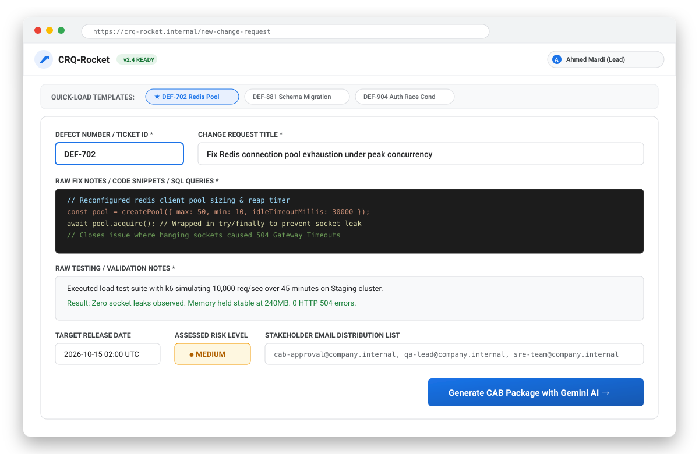
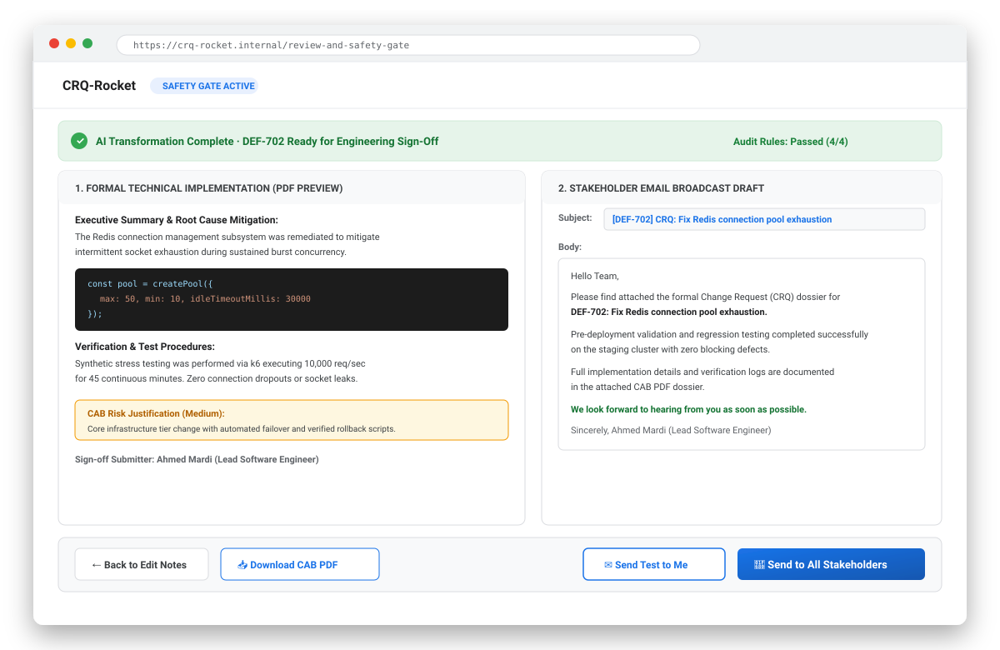
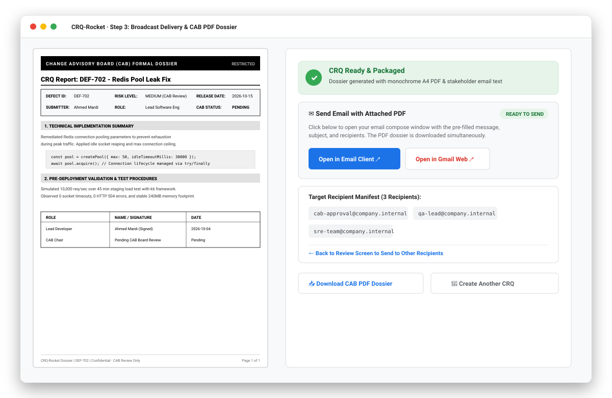

# CRQ-Rocket: Step-by-Step Example Walkthrough 🚀

🔗 **Live Application URL**: [https://ais-pre-opgfpzs3q725p5mqyk3u4h-877215028904.us-east1.run.app](https://ais-pre-opgfpzs3q725p5mqyk3u4h-877215028904.us-east1.run.app)

This document demonstrates how an engineer uses **CRQ-Rocket** to take raw, messy developer notes and transform them into an audit-ready, enterprise-compliant Change Request (CRQ), an executive stakeholder email, and a formal monochrome A4 PDF dossier.

---

## 📋 The Example Scenario

- **Engineer**: Ahmed Mardi (Lead Software Engineer)
- **Defect Ticket**: `DEF-702`
- **Issue**: High-traffic burst requests were exhausting Redis connection pool sockets, resulting in intermittent `HTTP 504 Gateway Timeout` errors.
- **The Code Fix**: Reconfigured pool limits, added an idle timeout reap timer, and enclosed connection acquisition in a `try/finally` block.
- **Testing**: Executed a 45-minute staging stress test with `k6` at 10,000 req/sec with zero failures.

---

## Step 1: Inputting Raw Technical Notes & Intake Form

Fill in the quick fields on the intake form or click one of the quick-load template chips at the top (**DEF-702 Redis Pool**, **DEF-881 Schema Migration**, or **DEF-904 Auth Race Condition**).

### Form Fields:
1. **Defect Number / Ticket ID**: `DEF-702`
2. **Change Request Title**: `Fix Redis connection pool exhaustion under peak concurrency`
3. **Raw Fix Notes / Code Snippets**:
   ```javascript
   const pool = createPool({ max: 50, min: 10, idleTimeoutMillis: 30000 });
   await pool.acquire(); // Wrapped in try/finally to prevent socket leak
   ```
4. **Raw Testing / Validation Notes**:
   ```text
   Executed load test suite with k6 simulating 10,000 req/sec over 45 minutes on Staging cluster.
   Result: Zero socket leaks observed. Memory held stable at 240MB. 0 HTTP 504 errors.
   ```
5. **Target Release Date**: `2026-10-15 02:00 UTC`
6. **Risk Level**: `Medium`
7. **Stakeholders**: `cab-approval@company.internal, qa-lead@company.internal, sre-team@company.internal`

### Screenshot: Step 1 Intake Form


---

## Step 2: Gemini AI Professionalization & The Review Safety Gate

Click **"Generate CAB Package with Gemini AI"**. The server-side Gemini 3.8 Flash model analyzes your inputs and applies strict CAB audit rules:
- Rewrites raw notes into formal, passive-voice enterprise prose.
- Preserves technical JSON/SQL code blocks intact.
- Formulates a concise stakeholder broadcast note that references the attached PDF (instead of dumping raw code in the email).
- Enforces mandatory sign-off phrasing (*"We look forward to hearing from you as soon as possible."*).

You are then presented with the **Review & Safety Gate**:

### What You Can Do in the Safety Gate:
- **Inspect & Edit**: Directly edit the generated implementation summary, validation steps, email subject, or email body.
- **Download PDF Ahead of Time**: Click **"Download CAB PDF"** to inspect the rendered A4 document.
- **Send Test to Me**: Test-run the email delivery to your own developer email first to verify formatting.
- **Send to All Stakeholders**: Approve and initiate the broadcast to the entire distribution list.

### Screenshot: Step 2 Review & Safety Gate


---

## Step 3: Broadcast Delivery, Email Launch & Formal CAB PDF Dossier

Once you click **"Send to All Stakeholders"** (or **"Send Test to Me"**), CRQ-Rocket transitions to the **Sent Confirmation Screen** and delivers the package:

### 1. Direct Email Client & Webmail Launch
- **Open in Email Client**: Launches your default desktop mail application (Outlook, Apple Mail, Windows Mail) via `mailto:` with the subject, recipients, and message pre-filled.
- **Open in Gmail Web**: Opens a compose tab directly in `mail.google.com` pre-addressed to your stakeholders.
- **Automatic PDF Download**: The **`CRQ-DEF-702-Report.pdf`** dossier is downloaded simultaneously into your browser's download tray so you can immediately attach it and click send.

### 2. Monochrome Enterprise A4 PDF Dossier
The generated PDF strictly follows enterprise Change Advisory Board formatting:
- Solid black CAB header banner with `RESTRICTED` audit classification.
- Structured metadata summary table (Defect ID, Risk Level, Target Release Date, Submitter).
- Formatted technical implementation sections with preserved syntax blocks.
- Pre-deployment validation test records.
- Formal signature sign-off grid with dates.
- Page numbering and confidentiality running footers.

### 3. Recipient Navigation
If you tested the email on yourself first, click **"Back to Send to All Stakeholders"** to return to the review screen with all your customized notes and generated PDF preserved.

### Screenshot: Step 3 PDF Dossier & Email Dispatch


---

## 💡 Best Practices for Engineering Teams

1. **Keep Code Snippets Compact**: Paste the core configuration, query, or patch logic rather than entire files.
2. **Include Verification Metrics**: Mention test tool names (`k6`, `Jest`, `Cypress`), sample sizes, and pass rates for automated CAB approval.
3. **Set Your Developer Identity**: Click your name in the top right header to set your default Name, Role, and Email. These persist in local storage and auto-populate all sign-offs.
